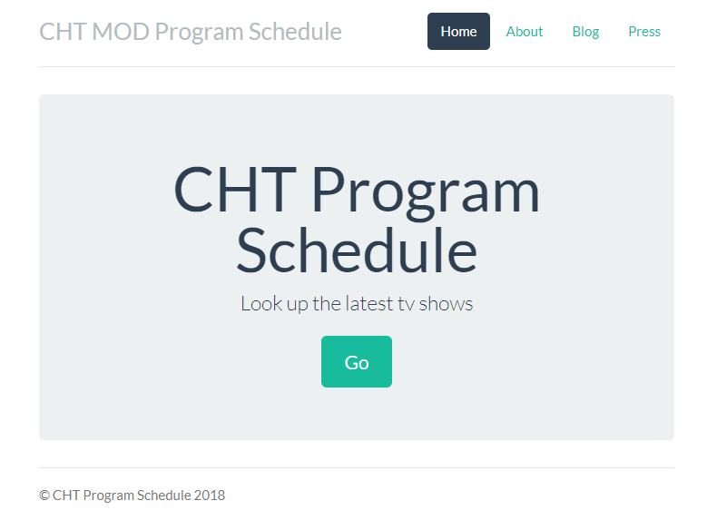

# Cht Mod Program Schedule

The **Cht Mod Program Schedule** is a sample application created to show how to do web crawler periodically. The project is based on the [Express](https://expressjs.com/) framework and [Bootstrap](http://getbootstrap.com/) to build a simple app that is deployed to [AWS Elastic Beanstalk](http://aws.amazon.com/elasticbeanstalk/). And its original project is from [AWS Sample](https://docs.aws.amazon.com/elasticbeanstalk/latest/dg/nodejs-getstarted.html). Also I would recommend to follow the [Getting Started with Node.js on Elastic Beanstalk](https://docs.aws.amazon.com/elasticbeanstalk/latest/dg/nodejs-getstarted.html) to build up the system.


## Requirements:
* express
* cheerio
* node-cron

## Installation
Execute this command to install the project:
```js
npm install
```

## Run
Execute this command to run the project:
```js
node app
```
## Live Demo
 > [Live Demo on AWS Elastic Beanstalk](http://tutorials-env.tfq3pbepbu.us-east-2.elasticbeanstalk.com/)
